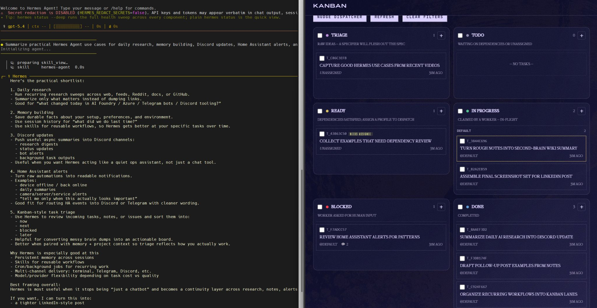
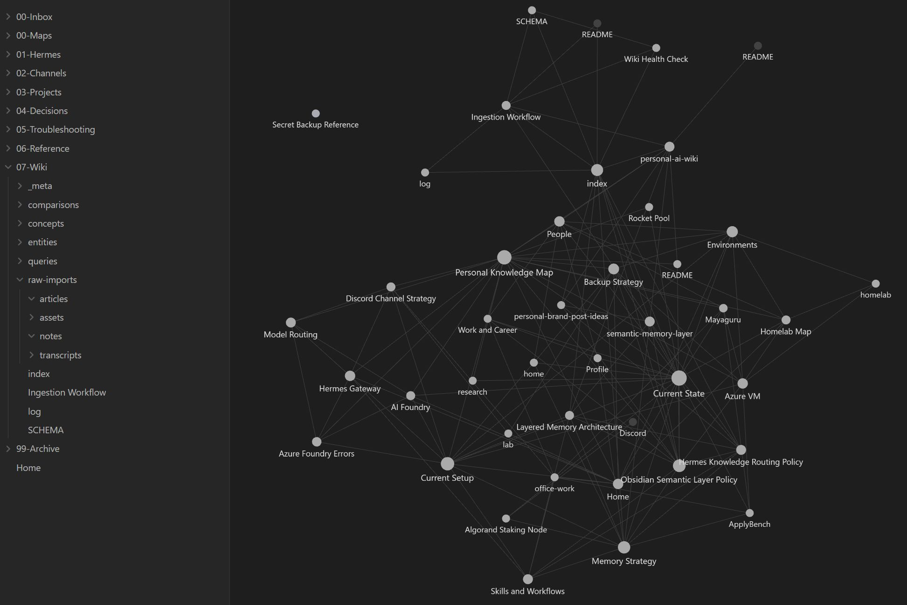
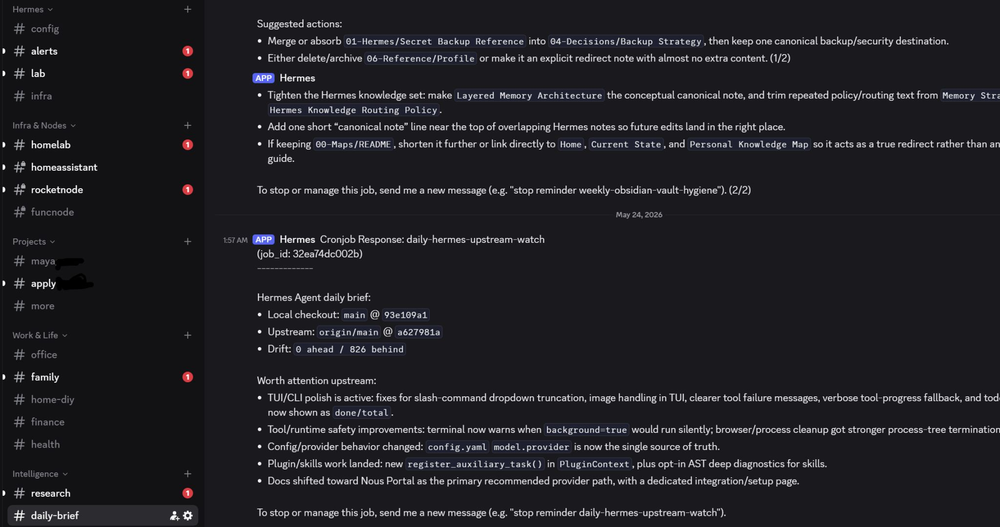

Lately I've been trying to make AI useful in my day-to-day, not just something I can demo once and forget about.

For me, the interesting part isn't a clever one-off answer. It's when the system starts to stick around — remembers context, helps with research, keeps notes organized, and quietly does a bit of work even when I'm not staring at the screen.

I was also looking for something I could continue from anywhere, including on mobile, without feeling too tied to one model or one company's chat history. I wanted the notes, memory, and context to build up slowly in a way that stays accessible to me.

A few things that have been especially useful:

### 1. A second memory layer

I don't want my "brain" to live inside one model. Notes, logs, and raw research go into Obsidian, and agents help turn that into cleaner wiki-style pages over time. A lot of this is inspired by the LLM-wiki / second-brain ideas people have been sharing recently, including Karpathy's broader direction around LLM-driven knowledge bases. I like that this becomes a personal semantic layer that keeps growing, even if I swap tools later.

### 2. A running work diary

Short summaries of what I worked on, what changed, and what I need to revisit have been surprisingly useful. It helps preserve the "why" behind the work instead of losing it in chat threads.

### 3. Daily research without tab overload

I've been using Hermes more for recurring research: track a few topics, pull in updates, summarize them, and drop the useful bits somewhere I'll actually see again.

### 4. Background workflows through Discord

This part feels very real to me. I have dedicated Discord channels where Hermes can send alerts, summaries, and progress updates. That continuity makes it feel more like a working system.

### 5. Home Assistant + home ops

On the home side, I like having Hermes close to Home Assistant and the homelab for practical things: cleaner alerts, useful nudges, automation tweaks, and remembering what I already debugged once.

### 6. Kanban / triage instead of pure chat

Some work just makes more sense as triage, routing, and follow-up instead of one giant prompt. That feels much closer to how real work actually happens.

### 7. Different models for different jobs

I've also stopped expecting one model to do everything perfectly. Some tasks need a stronger model; some just need something fast and cheap. Being able to route that intelligently matters.

What I like about this direction is that it compounds over time:

- the notes improve
- the memory improves
- the workflows improve

It's still a bit messy and experimental, but it's already more useful than my old "open 50 tabs and lose the thread" workflow.

I've also become a lot more opinionated about privacy and boundaries once memory, notes, alerts, and automation start connecting together.

I'll share more concrete examples from the projects I'm working on in a follow-up post.
